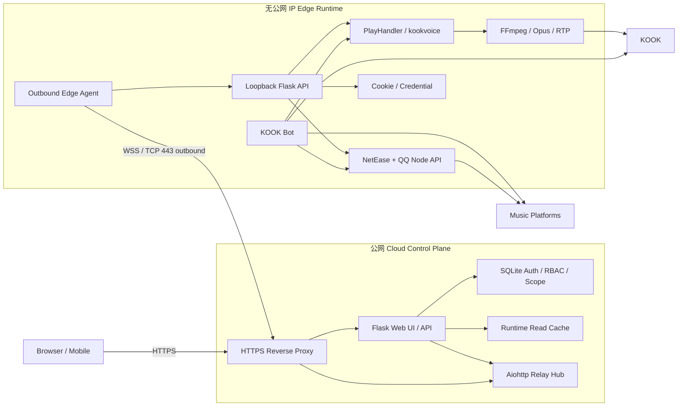
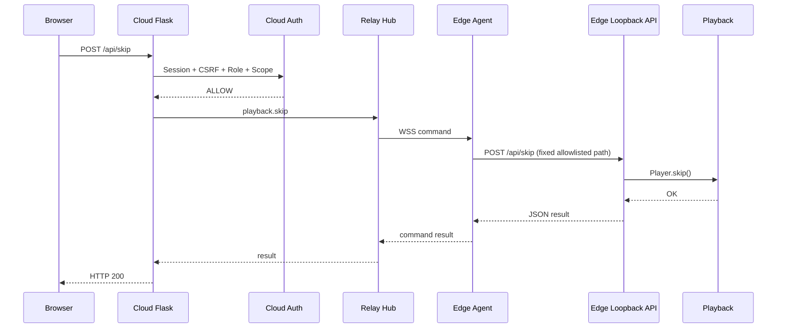
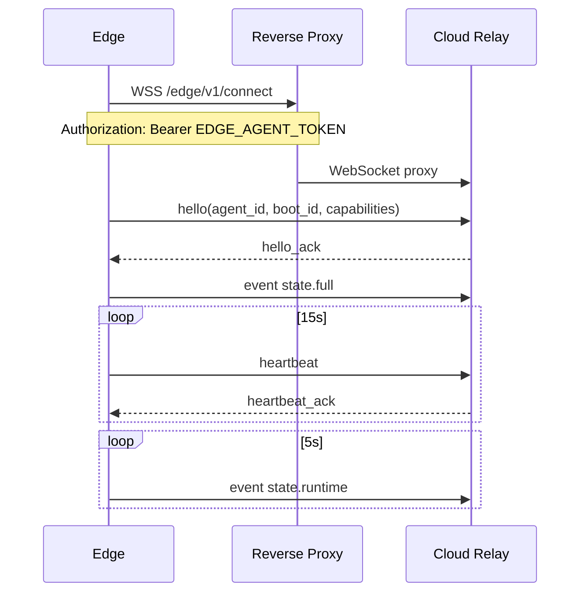
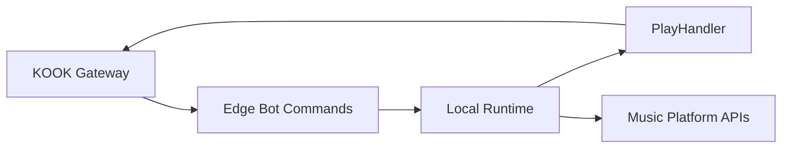

# Cloud / Edge 前后端分离架构

## 目标

该架构把公网 Web 控制面与私网播放执行端彻底分离：

- **Cloud Control Plane** 部署在有公网入口的云服务器，负责 HTTPS、页面、Web 用户、Session、RBAC/Scope、审计和 Edge 状态缓存。
- **Edge Runtime** 部署在没有公网 IP、但允许出站访问 Internet 的环境，继续负责 KOOK Bot、音乐平台凭据、Node API、PlayHandler、FFmpeg、Opus/RTP 和所有真实播放动作。
- Edge 主动向 Cloud 建立 `WSS` 长连接。Cloud 永远不需要主动连接 Edge，也不需要打通 Edge 的入站端口。
- KOOK Bot 指令继续完全在 Edge 本地执行。Cloud 离线时，Bot、现有播放队列和自动切歌仍可工作。

实现入口：

```text
cloud/run.py
edge/run.py
shared/relay_protocol.py
```

现有 `windows/run.py` / `Ubuntu/run.py` 仍保留为单机兼容模式。

## 总体架构图



## 数据边界

| 数据 / 能力 | Cloud | Edge |
|---|---:|---:|
| HTML/CSS/JS | ✅ | 仅单机兼容模式 |
| Web users / sessions | ✅ | ❌ |
| RBAC / Scope | ✅ | ❌ |
| Web audit | ✅ | ❌ |
| Agent registry | ✅ | ❌ |
| Guild/Channel read model | ✅ 副本 | ✅ 权威来源 |
| Queue/Now Playing | ✅ 短期副本 | ✅ 权威状态 |
| BOT_TOKEN | ❌ | ✅ |
| 网易 Cookie | ❌ | ✅ |
| QQ Cookie / refresh token | ❌ | ✅ |
| Bilibili SESSDATA | ❌ | ✅ |
| Node API | ❌ | ✅ |
| PlayHandler | ❌ | ✅ |
| FFmpeg/RTP | ❌ | ✅ |

公网 Cloud 不需要 Node.js、FFmpeg、BOT_TOKEN 或任何音乐平台登录凭据。

## Web 请求流程

浏览器 API Contract 保持不变，例如：

```text
POST /api/skip
GET  /api/search
GET  /api/playlist/current
```

Cloud 先执行现有 Web Session、CSRF、Role、Scope 检查，然后把允许的运行时请求转换成严格白名单 RPC。



Cloud 不发送 shell、任意 URL 或任意本地 path。`shared/relay_protocol.py` 是唯一允许的 Runtime Action 清单。

## WSS 协议

协议版本当前为 `v=1`。

Envelope：

```json
{
  "v": 1,
  "type": "command",
  "ts": 1788250000.0,
  "id": "command-id",
  "action": "playback.skip",
  "deadline": 1788250010.0,
  "payload": {
    "query": {},
    "json": {
      "guild_id": "123",
      "channel_id": "456"
    }
  }
}
```

消息类型：

```text
hello
hello_ack
heartbeat
heartbeat_ack
command
result
event
```

Edge 事件：

```text
state.full
state.runtime
state.account
```

连接流程：



WebSocket 本身启用 ping/pong；应用层 heartbeat 用于状态展示和故障判定。

## 命令语义

Cloud 不做离线命令排队。

如果 Agent 不在线：

```text
HTTP 503
code = EDGE_OFFLINE
```

如果命令超过 deadline：

```text
EDGE_TIMEOUT / DEADLINE_EXCEEDED
```

因此 `skip`、`pause` 等操作不会在 Edge 数分钟后恢复连接时突然执行。

每个命令有唯一 `id`。Edge 保存最近 1024 个结果用于去重；相同 `id` 重发时返回旧结果，不重复执行 `playlist.add` 等非幂等动作。

## 状态同步

Edge 是播放状态权威源。

首次连接、重连以及周期拓扑刷新时发送 `state.full`：

```text
agent metadata
guilds
channels
runtime
account status
```

正常运行每几秒发送 `state.runtime`：

```text
active channels
playlist snapshots
stats
debug health
```

Cloud 使用内存 Read Cache 服务以下高频 GET：

```text
/api/guilds
/api/channels
/api/channels/active
/api/playlist/current
```

这样浏览器轮询不会每次都跨公网 RPC。Cache 超时且 Edge 在线时自动回源；Edge 离线时允许返回带 `edge_stale=true` 的最后状态。

搜索、账号登录、播放写操作等仍实时 RPC。

## Edge 本地 API

`edge/run.py` 复用现有 Windows/Ubuntu 完整运行时，但强制：

```text
HOST=127.0.0.1
```

因此原 Flask API 不暴露 LAN/Internet。

Edge Agent 使用独立的 `data/edge_internal.db` 创建一个仅用于 loopback 调用的内部管理员 Session。该 Session：

- 不经过 Cloud；
- 不对浏览器公开；
- Token 只存在 Edge 进程内存和 Hash；
- 每 12 小时或认证失效时自动轮换；
- 只调用 `shared/relay_protocol.py` 中的固定路径。

这是一层兼容桥，使现有成熟的 Route、平台适配器和播放核心不需要在第一版 Remote 架构中复制。

## KOOK Bot

Bot 始终在 Edge：



Cloud 不参与 Bot 指令处理。

因此 Cloud Web 服务或 WSS Relay 暂时故障时：

```text
KOOK Bot             正常
正在播放             正常
队列自动推进         正常
FFmpeg/RTP           正常
Web UI               不可用或只显示旧状态
远程 Web 控制        不可用
```

## Agent 身份

第一版采用：

```text
TLS/WSS
+
256-bit 以上 Agent Token
```

Edge 在 WebSocket Upgrade 时发送：

```http
Authorization: Bearer <token>
X-Agent-ID: edge-main
```

Cloud SQLite 只保存 `SHA256(token)`，明文 Token 只来自部署环境变量。

Cloud 表：

```text
edge_agents
edge_agent_guilds
```

`edge_agent_guilds` 为未来多 Edge 部署提供 Guild → Agent 路由。

## 安全边界

禁止新增以下 Remote Action：

```text
shell
exec
subprocess
http.get arbitrary-url
file.read arbitrary-path
file.write arbitrary-path
```

即使 Cloud 被攻破，Relay 协议也只能触发明确列入 `ACTIONS` 的业务操作。

现有 Edge Route 仍继续执行：

- 请求字段长度/类型检查；
- 队列上限；
- 歌单导入上限；
- 媒体 URL 限制；
- Cookie/Credential 脱敏；
- FFmpeg 参数数组；
- 本地 Node API loopback 约束。

## 故障模型

| 故障 | Web UI | Web 播放操作 | KOOK Bot | 当前播放 |
|---|---:|---:|---:|---:|
| Cloud 挂 | ❌ | ❌ | ✅ | ✅ |
| Edge 挂 | ✅ | ❌ | ❌ | ❌ |
| WSS 中断 | ✅/旧状态 | ❌ | ✅ | ✅ |
| 音乐 Node API 挂 | ✅ | 部分失败 | 部分失败 | 已解析媒体可继续 |
| KOOK Gateway 异常 | ✅ | 受影响 | ❌ | 受影响 |

## 当前约束

Cloud Relay 和 Runtime Cache 当前为单进程内存状态，因此 Cloud 第一阶段按**单进程**运行。

不要直接把 Cloud Flask 启动成多个独立 worker，否则每个 worker 不共享 Agent WebSocket 和 Read Cache。需要水平扩容时，再引入 Redis/NATS 作为 Relay Bus 与共享状态层。

这一约束只存在于 Cloud；Edge 播放核心本来就是单进程所有权模型。
