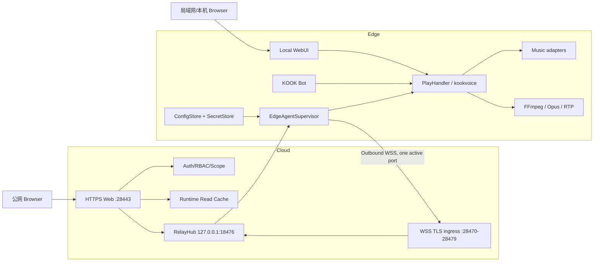

# Cloud / Edge 前后端分离架构

## 目标

本分支把公网 Web 控制面与无公网 IP 的 Edge 执行端分离，同时保留 Edge 完整本地 WebUI。

- Cloud：公网 HTTPS Web、Web Auth/RBAC/Scope、审计、Runtime Read Cache、WSS Relay。
- Edge：本地 WebUI、KOOK Bot、PlayHandler、FFmpeg、网易/QQ/Bilibili、Cookie/Credential。
- Edge 只需要出站 Internet，不需要公网 IP，也不开放入站 WSS。
- Cloud Web 与 Edge WSS 均使用独立非标准公网端口：Web 默认使用 `28443/tcp`，WSS 默认使用 `28470-28479/tcp` 端口池。
- 一个 Edge 任意时刻只维持一条 Active WSS；端口池是候选池，不是并发连接池。
- Cloud/WSS 故障不影响 Edge 本地 WebUI、KOOK Bot、当前播放与自动下一首。

## 总体架构



公网用户正式访问地址形态为：

```text
https://<cloud-domain>:28443/
```

Cloud Flask 本身仍只监听：

```text
127.0.0.1:18473
```

`28443` 仅由 Caddy/Nginx 等反向代理对公网监听并转发到 `18473`。

## 三条控制路径

```text
公网 WebUI -> Cloud Auth -> Relay RPC -> Edge Runtime
本地 WebUI -------------------------> Edge Runtime
KOOK Bot ---------------------------> Edge Runtime
```

三条路径共享同一个 Queue、PlayHandler 和音乐凭据，不复制播放状态。

## 公网端口边界

默认公网端口：

```text
28443/tcp         Cloud HTTPS WebUI
28470-28479/tcp   Edge WSS ingress pool
```

内部端口：

```text
127.0.0.1:18473   Cloud Flask
127.0.0.1:18476   Cloud RelayHub
```

项目不再把 `443/tcp` 作为 Cloud Web 正式业务入口。

如果使用 Caddy 自动申请和续期公网 TLS 证书，推荐额外允许 `80/tcp` 供 ACME HTTP-01 challenge 使用。`80/tcp` 是证书验证用途，不是 Cloud Web 正式访问端口。若使用 DNS challenge 或人工部署证书，可以根据证书方案关闭 80。

## WSS 端口池

默认公网池：

```text
28470-28479
```

Cloud 内部 Relay 仍只有一个：

```text
127.0.0.1:18476
```

反向代理负责把十个公网 TLS/WSS 端口全部收敛到该 Relay。

Edge 连接策略：

1. 优先尝试 `preferred_port`（上次成功端口）。
2. 其他候选端口随机化。
3. TCP timeout/refused/network unreachable 时自动切换下一个端口。
4. 全池失败后指数退避 + jitter，再开始下一轮。
5. `AUTH_FAILED`、TLS 证书错误、协议不兼容属于配置错误，不进行无意义的端口轮询。
6. 配置修改只重连 Agent，不重启 Bot/播放核心。

## Edge 动态配置

Edge 的远程配置不直接写 `.env`。首次启动从 `.env` bootstrap，随后以本地持久化为准：

```text
<platform>/data/edge_config.db
```

保存 relay enabled、host、port range、path、TLS、Agent ID/名称和 preferred port。

Agent Token 单独保存：

```text
<platform>/data/edge-agent.secret
```

API 只返回 `token_configured`，不回显明文 Token。

旧 `EDGE_RELAY_URL` 仍可 bootstrap；如果没有结构化 `EDGE_RELAY_HOST`，会解析旧 URL 并迁移成单端口池。

## 本地 WebUI

`edge/run.py` 继续复用 Windows/Ubuntu v2 应用，因此保留播放、音乐库、音乐账号、系统状态、设置、用户管理、桌面/移动端和主题能力。

Edge 设置页额外提供远程节点配置、端口池检测、连接状态和重新连接。

默认本地监听：

```text
127.0.0.1:18473
```

如需 LAN 访问，显式配置 `EDGE_LOCAL_WEB_HOST=0.0.0.0`，但 Auth/CSRF 不会关闭。

## 状态同步

Edge 是播放状态权威源。

- 首次连接/重连/周期拓扑刷新：`state.full`
- 正常运行：`state.runtime`
- 账号状态：`state.account`
- Cloud 使用 Read Cache 服务高频读请求
- 写操作、搜索、账号登录等仍实时 RPC

Cloud 离线时不排队播放命令；Edge 离线时 Cloud 返回 `EDGE_OFFLINE`。

## 安全边界

远程协议只允许 `shared/relay_protocol.py` 中的业务 Action。禁止新增 shell、exec、任意 subprocess、任意 URL proxy 或任意文件读写。

Cloud 不持久化 BOT_TOKEN、音乐 Cookie、QQ refresh token 或 Bilibili SESSDATA。

公网防火墙不要开放：

```text
18473
18474
18475
18476
```

Edge 也不需要公网入站端口。

## 当前扩展边界

Cloud Relay/Read Cache 第一阶段仍是单进程内存状态，因此 Cloud 运行单进程。未来水平扩容需要 Redis/NATS 等共享 Bus；这与 Edge 端口池故障转移是两个独立问题。
